# Práctica de ampliación: Configuración de un servidor Nginx con Hosts Virtuales y directorios de usuario

La implementación de esta práctica implica la configuración de un servidor web Nginx para el enrutamiento de múltiples rutas asociadas a los usuarios que se generarán.

## Conexión al servidor mediante SSH

Para la ejecución de la práctica, se procederá utilizando el protocolo SSH como método de conexión al servidor desde el anfitrión, y se adjunta una captura de pantalla que documenta el proceso de acceso al servidor.
```Powershell
    ssh <user>@<host>
```

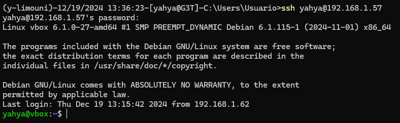

## Creación de usuarios y carpetas

En esta sección, llevaremos a cabo la creación de dos usuarios, junto con sus respectivas carpetas asignadas

### Creación de usuarios

Creamos los usuarios necesarios para esta práctica. que serián los usuarios ```mohamed``` y ```fettouma```, usando los comandos siguientes.

<br>

```bash 
    sudo useradd -m -s /bin/shell <username>
```
* ```useradd```: Comando para crear un nuevo usuario
* ```-m```: Crea automáticamente la carpeta home del usuario.
* ``-s``: /bin/bash: Asigna bash como shell predeterminada.
* ```<username>```: Nombre del usuario a crear.

<br>

```bash
    sudo passwd <username>
```

* ```passwd```: Comando para establecer
* ```<username>```: Nombre del usuario al que se le asignará la contraseña

En mi caso sería:

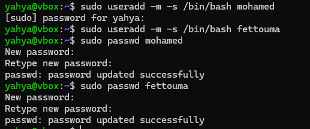

Se han creado los usuarios ``mohamed`` y `fettouma` con sus directorios correspondientes (en home).

<br>

### Creación de carpetas con los permisos necesarios

Vamos a crear una carpeta para que Nginx pueda mostrar las páginas web de cada usuario. seguimos los siguientes pasos:

1. Iniciamos sesion con el usuario usando `su <username>`
2. Nos dirigimos a la carpeta `cd ~`
3. Creamos la carpeta `public_html` donde se guardarán los archivos de la web. `mkdir public_html`
4. Cambiar los permisos para que pueda acceder nginx usando el comando `setfacl` que permite manejar permisos de archivos y carpetas de una manera más detallada que el comando ```chmod```.

    -> Estructura del comando:
    ```bash
        setfacl [options] [mode] [file]
    ```

    * `options`: puede ser **-x** (exluir) **-m** (modificar) **-b** (eliminar) **-R** (recursividad) **-d** (se aplican los permisos a cada archivo que se crea posteriormente)
    * `mode`: para especificar si es un usuario, un grupo o otros especificando los permisos deseados Ejemplo: **u:username:rwx**.
    * `file`: el archivo o direcotio al cual se aplicarán los permisos

5. Comprobar que se hayan establecido los permisos de forma correcta usando el comando:
    ```bash
        getfacl <filename>
    ```

<br>

En mi caso seria lo siguiente para los dos usuarios:

* Usuario **mohamed**

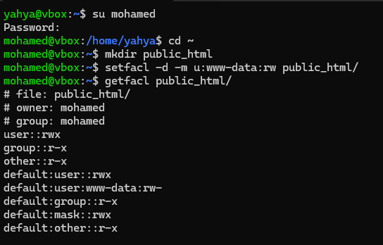

* Usuario **fettouma**

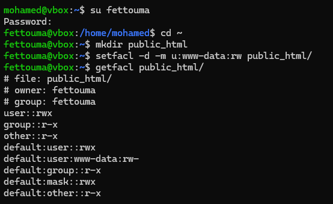

### Creación de páginas webs estáticas

Creamos una página estática básica para cada usuario para comprobar el funcionamiento de nuestro servidor.

* usuario **mohamed**

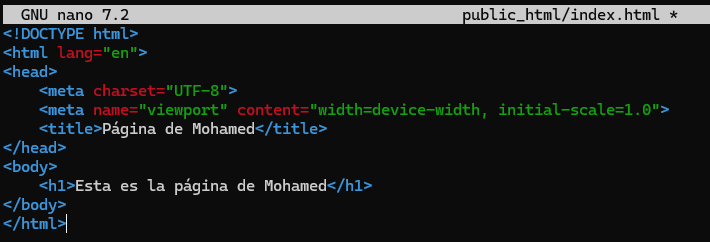

* usuario **fettouma**

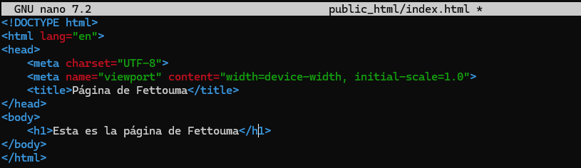

## Nginx

En esta sección vamos a instalar y configurar nginx para acceder a nuestros hosts virtuales.

### Instalación de Nginx

Instalamos Nginx mediante el gestor de paquetes de debian `apt`.

Comandos a ejecutar: 

```bash
    sudo apt-get update # Actualiza la lista de paquetes disponibles y sus versiones en los repositorios configurados
    sudo apt-get upgrade #  Instala las actualizaciones de los paquetes ya instalados en el sistema, sin eliminar ni instalar nuevos paquetes
    sudo apt-get install nginx -y # Instala el servidor web Nginx en el sistema. La opción -y (opcional) acepta automáticamente todas las preguntas durante la instalación
```

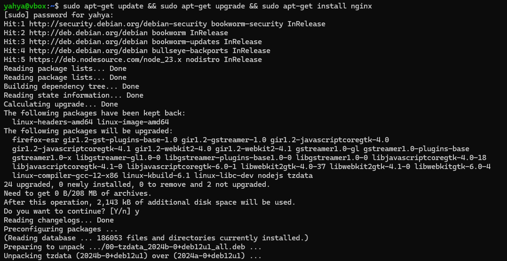

Ejecutamos el comando siguiente para comprobar que todo funciona correctamente

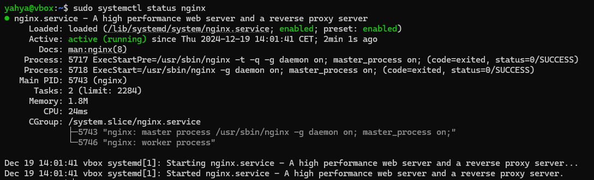

O también aceediendo a la página por defecto de Nginx desde el navegador `http://127.0.0.1/`

### Generación de los certificados SSL

Antes de proceder a la configuración de los hosts virtuales, generamos las claves ssl para una conexión segura mediante **https** aplicando el comando:

```bash
    sudo openssl -req -x509 -newkey rsa:4096 -days 365 -sha256 -nodes -out <archivo_cert> -keyout <archivo_key>
```

* `-req`: Indica que se está procesando una solicitud de certificado.
* `-x509`: Genera un certificado autofirmado en lugar de una solicitud de certificado.
* `-newkey rsa:4096`: Crea una nueva clave privada RSA de 4096 bits.
* `-days 365`: Establece la validez del certificado por 365 días14.
* `-sha256`: Utiliza el algoritmo de hash SHA-256 para firmar el certificado.
* `-nodes`: No cifra la clave privada.
* `-out <archivo_cert>`: Especifica el nombre del archivo de salida para el certificado.
* `-keyout <archivo_key>`: Especifica el nombre del archivo de salida para la clave privada.

Generamos uno para cada usuario:

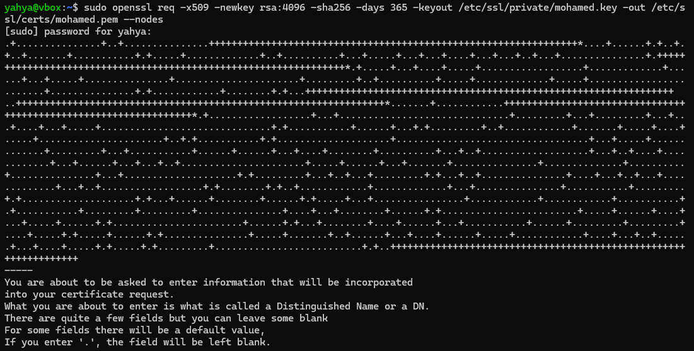

### Configuración de los Hosts Virtuales:

Para configurar nuesto host virtual para que redirija las peticiones http a https metemos el siguiente bloque server:

```bash
server {
    listen 80;
    listen [::]:80;
    server_name ejemplo.com;

    # Redirigir las peticiones http a https con el mismo host y URI
    return 301 https://$host$request_uri;
}
```

Bloque **server** para la configuración de HTTPS con las claves ssl generadas anteriormente:

```bash
server {
    listen 443 ssl;
    listen [::]:443 ssl;

    # Nombre del servidor
    server_name ejemplo.com;
    
    # Ruta a la raiz del servidor
    root /ruta/a/public_html;
    index index.html index.htm index.debian-html;
    
    # Claves SSL generadas
    ssl_certificate /ruta/al/certificado.pem;
    ssl_certificate_key /ruta/a/clave_privada.key;

    location / {
        # Si no se encuentra la ruta se devuelve un error 404
        try_files $uri $uri/ =404;
    }
}
```

<br>

En mi caso es: (para la pagina del usuario mohamed) 

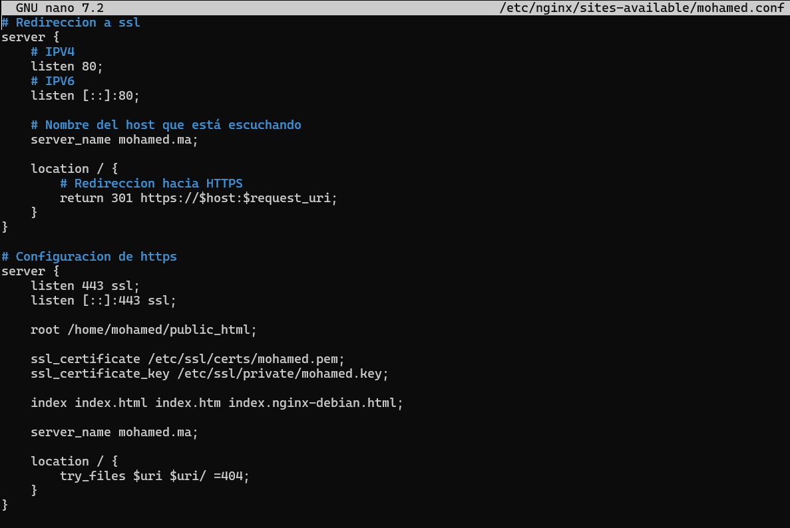


### Activar los hosts virtuales

Para activar nuestros hosts, hay que crear enlaces simbolicos de los archivos de configuracion creados al directorio `/etc/nginx/sites-enabled`

```bash
    sudo ln -s /etc/nginx/sites-available/<conf_file> /etc/nginx/sites-enabled
```

En mi caso es:

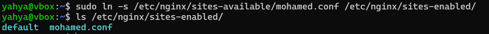

Comprobamos la sintaxis de los archivos de configuracion, si todo OK, reiniciamos el servicio de Nginx:

Comando para comprobar la sintaxis:
```bash
    sudo nginx -t
```

Comando para reiniciar el servicio de Nginx:
```bash
    sudo systemctl restart nginx
```

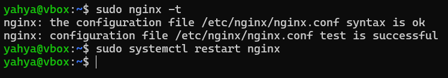

### Agregar los nombres de los hosts:

Para poder acceder a nuestros hosts desde la máquina anfitriona, hay que añadirlos al archivo hosts, situado en `C:\Windows\System32\drivers\etc\hosts` para Windows y `/etc/hosts` para Linux.

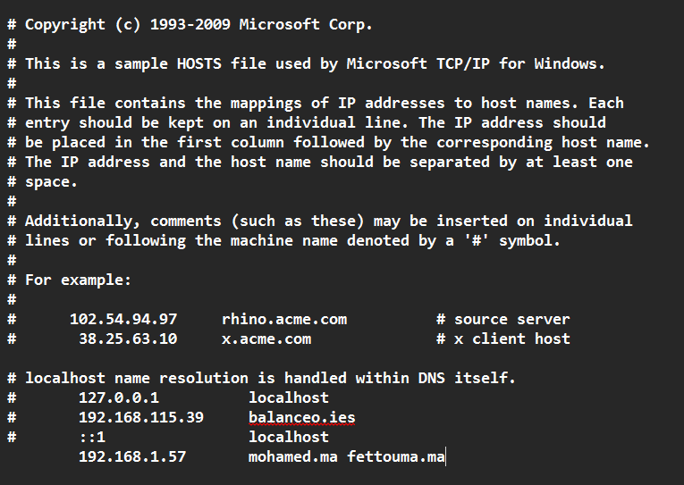

### Prueba de funcionamiento de los hosts

Y ahora ya podemos proceder a la comprobación del funcionamiento de nuestros hosts virtuales.

* Para el usuario `mohamed`


* Detalles del certificado autofirmado:

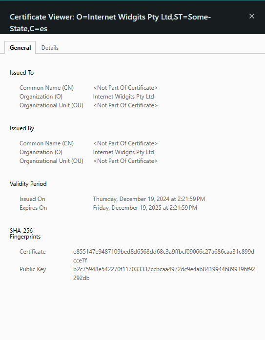

* Para el usuario `fettouma`

